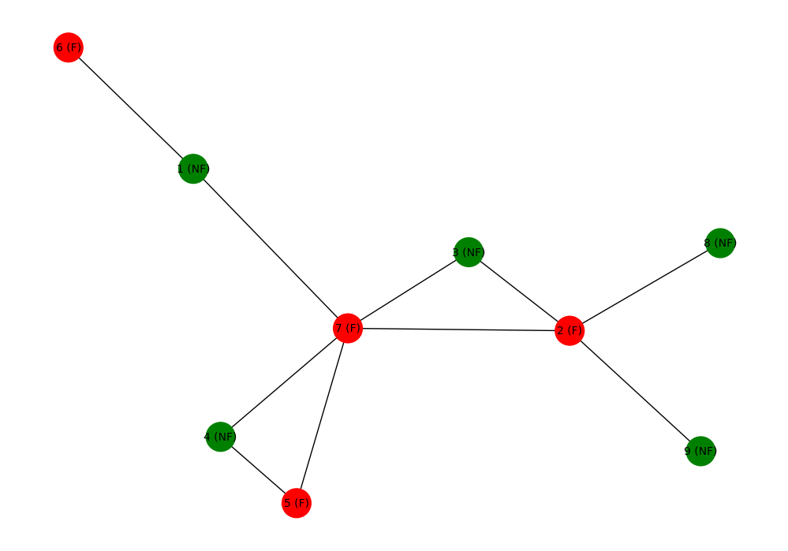

# Social Network Analysis

In this project, I aimed to detect fraudulent behavior within a network using social network analysis. I applied several centrality measures (such as degree, influence, and proximity) to evaluate the importance of individuals in the network. I proposed two approaches:
    - a basic analysis based on individuals' connections,
    - a more advanced method that combines these centrality measures with existing fraud scores to predict the likelihood of an individual's involvement in fraudulent activities.

